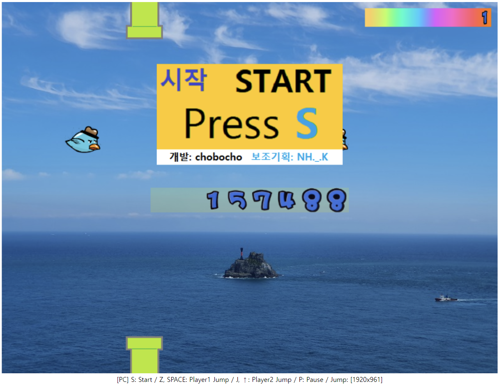
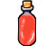
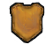

# JsFloppyBird for two players
## Floppy bird Javascript Edition

### How to play
* Mobile
  * Touch screen : Jump 
  * Touch Pause Icon : Pause
  
* Mouse
  * Click : Jump

* Key
  * Space : Player1 jump
  * Z : Player1 Jump
  * Up arrow : Player2 jump
  * J : Player2 Jump
  * P : Pause
  * S : Start / Resume
  * Enter : Start / Resume

### Item  
  
* 3 point increase in energy  

* 12 point increase in energy  

* 32 point increase in energy  

* Hold defense for 5 seconds
